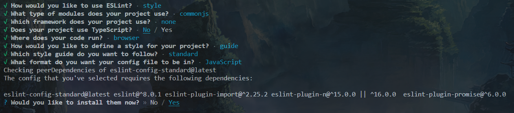

# frontend-preframe-learning

[TOC]

前端学习路线：

https://www.bilibili.com/read/cv5650633


前端框架前置学习：

【Ajax】https://www.bilibili.com/video/BV1WC4y1b78y/?p=30&spm_id_from=pageDriver&vd_source=b850b3a29a70c8eb888ce7dff776a5d1

【Promise】

https://www.bilibili.com/video/BV1Tm4y1h7SY?p=69&vd_source=b850b3a29a70c8eb888ce7dff776a5d1

【Axios】

https://www.bilibili.com/video/BV1wr4y1K7tq/?p=12&spm_id_from=pageDriver&vd_source=b850b3a29a70c8eb888ce7dff776a5d1

【TypeScript】

https://www.bilibili.com/video/BV1Xy4y1v7S2?p=30&vd_source=b850b3a29a70c8eb888ce7dff776a5d1

【ESLint】

https://www.bilibili.com/video/BV1Eg411P7gr?p=17&vd_source=b850b3a29a70c8eb888ce7dff776a5d1

【Babel】

https://www.bilibili.com/video/BV1xY4y1z7Tv/?spm_id_from=333.337.search-card.all.click&vd_source=b850b3a29a70c8eb888ce7dff776a5d1

【Vite】

https://www.bilibili.com/video/BV1BS4y1P7mU/?vd_source=b850b3a29a70c8eb888ce7dff776a5d1

【Node.js】

https://www.bilibili.com/video/BV1rA4y1Z7fd/?vd_source=b850b3a29a70c8eb888ce7dff776a5d1

# 一、AJAX[*ˈeɪdʒæks*]

## 1、什么是AJAX

​		Ajax是异步的JavaScript和XML（Asynchronous JavaScript And XML）。简单点说，就是使用XMLHttpRequest对象与服务器通信。它可以使用JSON，XML，HTML和text文本等格式发送和接收数据。

​		Ajax最吸引人的就是它的“异步”特性，也就是说它可以在不重新刷新页面的情况下与服务器通信，交换数据，或更小页面。

## 2、AJAX的特点

- Ajax的优点
  - 可以无需刷新页面与服务器端进行通信。
  - 允许你根据用户事件来更新部分页面内容。


- Ajax的缺点
  - 没有浏览历史，不能回退
  - 存在跨域问题（同源）
  - SEO不友好


## 3、Ajax的使用

- 先使用axios库，与服务器进行数据通信

  http://www.axios-js.com/zh-cn/

  - url

  
  
  - 常用请求方法
  
  | 请求方法 | 操作             |
  | -------- | ---------------- |
  | GET      | 获取数据         |
  | POST     | 提交数据         |
  | PUT      | 修改数据（全部） |
  | DELETE   | 删除数据         |
  | PATCH    | 修改数据（部分） |
  

## 4、跨域

### 4.1、同源策略

同源策略（Same-Origin Policy）最早由 Netscape 公司提出，是浏览器的一种安全策略。

同源：协议、域名、端口号 必须完全相同。

违背同源策略，就是跨域。

### 4.2、如何解决跨域

#### 4.2.1、JSONP

**1.JSONP是什么**

JSONP（JSON with Padding），是一个非官方的跨域解决方案，纯粹凭借程序员的聪明才智开发出来，只支持get请求。

**2.JSONP如何工作的？**

在网页有一些标签天生具有跨域能力，比如：img/link/iframe/script。

JSONP就是利用script标签的跨域能力来发送请求的。

**3.JSONP的使用**

1. 动态的创建一个script标签

```js
const script = document.createElement("script");
```

2. 设置script的src，设置回调函数

```js
script.src = "http://localhost:3000/testAJAX?callback=abc";
```


#### 4.2.2、CORS

https://developer.mozilla.org/zh-CN/docs/Web/HTTP/Access_control_CORS

**1.CORS是什么？**

CORS（Cross-Origin Resource Sharing），跨域资源共享。CORS是官方的跨域解决方案，它的特点是不需要在客户端做任何特殊的操作，完全在服务器中进行处理；支持get和post请求。跨域资源共享标准新增了一组HTTP首部字段，允许服务器声明哪些源站通过浏览器有权限访问哪些资源。

**2.CORS怎么工作的？**

CORS是通过设置一个响应头来告诉浏览器，该请求允许跨域，浏览器收到该响应以后就会对响应放行。

**3.CORS的使用**

主要是服务器端的设置：

router.get("/testAJAX", function(req,res){}


# 二、Promise从入门到精通

## 1、什么是Promise？


## 


## 2、宏队列与微队列

<span style="color:red;font-weight:bold;">同步队列==>微队列==>宏队列</span>


## 3、Promise源码

# 三、Axios

https://www.npmjs.com/package/axios

【中文网】 http://www.axios-js.com/

## 1、Axios 0.x版本

> Axios 0.x 版本是旧版的 Axios，它支持浏览器和 Node.js 环境。
> 它使用的是基于 XHR（XMLHttpRequest）的传统 AJAX 请求。
> 在 0.x 版本中，Axios 使用回调函数来处理响应结果。

## 2、Axios 0.21.x版本

> Axios 0.21.x 版本是更新的版本，同样支持浏览器和 Node.js 环境。
> 它使用的是基于浏览器的 Fetch API 和 Node.js 的 http 模块进行请求。
> 在 0.21.x 版本中，Axios 使用 Promise 和 async/await 语法来处理响应结果，使代码更简洁和易读。

# 四、TypeScript

https://www.typescriptlang.org/

## 1、安装与编译

- 安装

```js
npm i -g typescript
```

- 测试

```js
$ tsc
```

- 编写TS并编译为JS

```js
// 文件名：hello.ts
console.log("hello ts");

// 编译命令
tsc hello.ts
```


## 2、TS基本类型

- 类型声明

  - 类型声明是TS非常中友好的一个特点

  - 通过类型声明可以指定TS中变量（参数、形参）的类型

  - 指定类型后，当为变量赋值时，TS编译器会自动检查值是否符合类型声明，符合则赋值，否则则报错

  - 简而言之，类型声明给变量设置了类型，使得变量只能存储某种类型的值

  - 语法：

    - ```typescript
      let 变量: 类型;
      let 变量: 类型 = 值;
      function fn(参数: 类型, 参数: 类型) : 类型 {
          
      }
      ```

- 自动类型判断

  - TS拥有自动的类型判断机制
  - 当对变量的声明和赋值是同时进行的，TS编译器会自动判断变量的类型
  - 所以如果你的变量的声明和赋值是同时进行的，可以省略掉类型声明

- 类型

| 类型    | 例子              | 描述                           |
| ------- | ----------------- | ------------------------------ |
| number  | 1,-33,2.5         | 任意数字                       |
| string  | 'hi',"hi"         | 任意字符串                     |
| boolean | true,false        | 布尔值true或false              |
| 字面量  | 其本身            | 限制变量的值就是该字面量的值   |
| any     | *                 | 任意类型                       |
| unknown | *                 | 类型安全的any                  |
| void    | 空值（undefined） | 没有值（或undefined）          |
| never   | 没有值            | 不能是任何值                   |
| object  | {name: '孙悟空'}  | 任意的JS对象                   |
| array   | [1,2,3]           | 任意JS数组                     |
| tuple   | [4,5]             | 元素，TS新增类型，固定长度数组 |
| enum    | enum(A, B)        | 枚举，TS中新增类型             |


## 3、编译选项

- 自动编译文件

  - 编译文件时，使用-w指令后，TS编译器会自动监视文件的变化，并在文件发生变化时对文件进行重新编译。

  - 示例：

    - ```shell
      tsc xxx.ts -w
      ```

  - 自动编译整个项目

    - 如果直接使用tsc指令，则可以自动将当前项目下的所有ts文件编译为js文件。

    - 但是能直接使用tsc命令的前提时，要先在项目根目录下创建一个ts的配置文件tsconfig.json。

    ```shell
    $ npx tsc --init
    ```

    - tsconfig.json是一个JSON文件，添加配置文件后，只需要tsc命令即可完成对整个项目的编译

    - 配置选项

      - include

        - 定义希望被编译文件所在的目录

        - 默认值：`["**/*"]`
    
        - 示例：

          ```json
          "include":["src/**/*", "tests/**/*"]
          ```

          - 上述示例中，所有src目录和tests目录下的文件都会被编译
    
        - 执行：

          ```shell
          $ tsc -w
          ```

      - exclude

        - 定义需要排除在外的目录

        - 默认值：`["node_modules","bower_components","jspm_packages]`
    
        - 示例：

          ```json
          "exclude": ["./src/hello/**/*"]
          ```

          - 上述示例中，src下hello目录下的文件都不会被编译
    
      - extends
    
        - 定义被继承的配置文件
        - 示例：

        ```json
        "extends": "./configs/base"
        ```

        - 上述示例中，当前配置文件中会自动包含configs目录下base.json中的所有配置信息
    
      - files
    
        - 指定被编译文件的列表，只有需要编译的文件比较少的时候才会用到。
        - 示例：
    
        ```json
        "files":[
            "core.ts",
            "sys.ts",
            "types.ts",
            "scanner.ts",
            "parse.ts",
            "utilities.ts",
            "binder.ts",
            "checker.ts",
            "tsc.ts"
        ]
        ```

        - 列表中的文件都会被TS编译器所编译。

      - compilerOptions

        - 编译选项是配置文件中非常重要也比较复杂的配置选项。

        - 在compilerOptions中包含多个子选项，用来完成对编译的配置。

          - 项目选项

            - target

              - 设置ts代码编译的目标版本

              - 可选值：

                - ES3（默认）、ES5、ES6/ES2015、ES7/ES2016、ES2017、ES2018、ES2019、ES2020、ESNext
    
              - 示例：
    
                ```json
                "compilerOptions": {
                	"target": "ES6"""
                }
                ```

                - 如上设置，我们所编写的TS代码将会被编译为ES6版本的JS代码

            - module

              - 指定要使用的模块化的规范

            - lib

              - 指定代码运行时所包含的库（宿主环境）

              - 可选值：
    
                - 示例：
    
                  ```json
                  "compilerOptions": {
                  	"target": "ES6",
                      "lib": ["ES6", "DOM"],
                      "outDir": "dist",
                      "outFile": "dist/aa.js"
                  }
                  ```

            - outDir

              - 用来指定编译后文件所在的目录
    
            - outFile
    
              - 设置outFile后，所有的全局作用域中的代码会合并到同一个文件

## 4、webpack

https://www.webpackjs.com/

```shell
$ npm i -D webpack webpack-cli html-webpack-plugin webpack-dev-server clean-webpack-plugin typescript ts-loader
```

```shell
$ npm i -D @babel/core @babel/preset-env babel-loader core-js
```

# 五、ESLint

【官网】https://eslint.bootcss.com/

【中文官网】https://eslint.nodejs.cn/

## 1、介绍

### 1.0、先决条件

要使用 ESLint，你必须安装并构建 [Node.js](https://nodejs.cn/)（`^12.22.0`、`^14.17.0` 或 `>=16.0.0`）并支持 SSL。 （如果你使用的是官方 Node.js 发行版，则始终内置 SSL。）

### 1.1、Getting Started with ESLint

ESLint是在ECMAScript/JavaScript代码中识别和报告模式匹配的工具，它的目标是保证代码的一致性和避免错误。在许多方面，它和JSLint、JSHint相似，除了少数的例外：

- ESLint使用Espree解析JavaScript
- ESLint使用AST去分析代码中的模式
- ESLint是完全插件化的。每一个规则都是一个插件并且你可以在运行时添加更多的规则。

ESLint本身是一个语法规范检查的包。

### 1.2、为什么要用ESLint

<span style="color:orange;font-weight:bold;">代码千万行，安全第一行；前端不规范，同事两行泪！</span>

- 统一团队编码规范（命名，众多格式等）
- 统一语法，毕竟ES版本已经不少了（var/let...）
- 减少git不必要的提交（如果文件格式不一样，也会被git提交的）
- 避免低级错误
- 在编译时检查语法，而不是等JS引擎运行时才检查

### 1.3、ESLint用法

- 可以手动下载配置
- 可以通过vue脚手架创建项目时自动下载配置

## 2、认识ESLint

> 需要注意的是：ESLint有两个工具，一个是模块包，一个是VSCode的扩展工具。

### 2.1、ESLint包

- 安装方式：
  - 通过npm直接进行全局或项目安装 `npm i eslint -D`
  - 通过vue脚手架创建项目时，选择安装ESLint模块包`vue create 创建项目过程中选择 lint`

## 3、手动下载配置（原理）

### 3.1、创建项目

- 创建一个测试文件夹：`eslint-test`
- 初始化项目：`npm init -y`（创建package.json）

### 3.2、ESLint安装

- 直接在项目中安装eslit包：

```shell
$ npm i eslint -D
```

- 注意安装结果：node_modules中下载了很多包

  - *.bin/eslint.cmd**脚本文件，内部通过nodejs执行eslint运行包的代码

  - **@eslint包**用来规范eslint配置文件

  - **eslint开头的包**是eslint运行包，包含eslint代码

  

### 3.3、生成ESLint配置文件

> ESLint可以创建独立的配置文件`.eslintrc.js`，也可以直接在`package.json`中配置

- 执行`node_modules/.bin`文件夹里的**ESLint脚本**来创建配置文件
  - 包含完整脚本路径的命令：

```shell
$ ./node_modules/.bin/eslint --init
```

- 也可以使用npx来执行（**推荐**）：
  - npx是随着node一起安装的，能去**.bin目录**里找目标脚本文件，简化执行脚本的语法。

```shell
$ npx eslint --init
```

- 也可以使用npm来执行：

```shell
$ npm init @eslint/config
```

- 创建配置文件过程中，需要选择配置


<center><span style="color:red;font-weight:bold;">分步选择截图</span></center>



<center><span style="color:red;font-weight:bold;">选择结果汇总截图</span></center>

### 3.4、生成配置结果

- 创建了配置文件`.eslintrc.js`

```shell
module.exports = {
  env: {
    browser: true,
    commonjs: true,
    es2021: true
  },
  extends: 'standard',
  overrides: [
    {
      env: {
        node: true
      },
      files: [
        '.eslintrc.{js,cjs}'
      ],
      parserOptions: {
        sourceType: 'script'
      }
    }
  ],
  parserOptions: {
    ecmaVersion: 'latest'
  },
  rules: {
  }
}
```

- 下载了相关规范包

主要是下载了standard语法规范包，而它需要用到import/node/promise包

```js
{
  // ......
  "devDependencies": {
    "eslint": "^8.47.0",
    "eslint-config-standard": "^17.1.0",
    "eslint-plugin-import": "^2.28.0",
    "eslint-plugin-n": "^16.0.1",
    "eslint-plugin-promise": "^6.1.1"
  }
}
```

### 3.5、ESLint执行检查

- 命令：

```shell
$ npx eslint ./需要检查语法的文件路径
```

- 如果违反规范，会将错误提示到终端，说明ESLint工作正常


## 4、ESLint配置文件入门

### 4.1、配置文件格式

- 我们通过`npx eslint --init`创建配置文件时，有提供配置文件的格式给我们选择：
  - **.js**
  - .yaml
  - .json
- eslint的加载顺序是：
  - **.eslintrc.js**
  - .eslintrc.cjs
  - .eslintrc.yaml
  - .eslintrc.yml
  - .eslintrc.json
  - package.json

### 4.2、JS格式使用模式

- 我们注意到配置文件内部使用的module.exports导出配置数据
- 这是因为我们添加配置文件时，选择了`CommonJS`

- 如果选择了`JavaScript modules`，那么就会是使用export导出配置数据
- 推荐：**CommonJS**
  - 由于我们开发时一般使用的是vue脚手架，内部webpack打包默认用的CommonJS
  - 所以ESLint配置文件，应该尽可能与它保持一致

### 4.3、env节点

```js
module.exports = {
    env: {
        browser: true,
        commonjs: true,
        es2021: true,
    },
    // ......
}
```

- 由于ESLint的各种规范中，一般都不允许使用未在页面内声明的成员
- 而开发中经常会用到一些运行环境自带的api，如：
  - 浏览器中的window/document等
  - nodejs中的__dirname等
  - es2021中的WeakRef等
- 所以要告诉ESLint，当前代码是运行在哪些环境中，这样检查时就不会报错了

### 4.4、globals节点

```js
module.exports = {
    // ......
    globals: {
        /**
         * 定义 jQuery
         * 说明 $ 这个变量可以全局使用，无需定义
         * true-可以访问$，且可以修改$的值
         * false-可以访问$，但是不可以修改$的值
         */
        $: false,
        /**
         * 定义 lodash
         */
        _: false,
    }
    // ......
}
```

- 也可以使用`globals`节点来手动配置全局成员
- 注意：这个节点需要手动添加，默认是没有的

### 4.5、extends节点

```js
module.exports = {
    // ......
    extends: ['standard'/* 'eslint:recommended' */],
    // ......
}
```

- ESLint检查时使用哪些规范呢？通过这个节点可以配置使用 <span style="color:red;font-weight:bold;">内置规范</span> 还是 <span style="color:red;font-weight:bold;">第三方规范</span>
  - 这里配置的是使用第三方下载的`eslint-config-standard`规范
  - 注意：配置extends时，可以省略`eslint-config-`，直接写成`standard`

### 4.6、parseOptions节点

```js
module.exports = {
    // ......
    parserOptions: {
        ecmaVersion: "latest",
    },
    // ......
}
```

- ESLint解析器解析代码时，可以指定用哪个JS的版本
- 注意：这里是指定检查时按照哪个JS版本语法检查，但这里不包含全局变量
- 全局变量需要通过前面的`env`节点配置

### 4.7、rules节点

```js
module.exports = {
    // ......
    rules: {
    }
    // ......
}
```

- 两个用法：

  - 不使用`extend`节点配置**整套的规范**，而是在`rules`节点中直接配置

  - 使用`extend`节点配置**整套的规范**，在`rules`节点中修改部分规范的配置

    - eg：

    ```js
    module.exports = {
        extends: ["standard" /* 'eslint:recommended' */],
        // ......
        rules: {
            "space-before-function-paren": 0, // 在 function 定义左括号之前强制执行一致的间距
            "array-bracket-spacing": 0, // 在数组括号内强制执行一致的间距
            quotes: ["off", "double"], // 强制一致使用反引号、双引号或单引号
            "comma-dangle": 0, // 要求或禁止尾随逗号
            indent: ["error", 4], // 强制执行一致的缩进
            semi: 0, // 0-关闭 1-警告 2-报错  要求或禁止使用分号而不是 ASI
        },
    };
    ```

    

## 5、ESLint检查语法的规则

https://eslint.nodejs.cn/docs/latest/rules/

### 5.1、ESLint语法规范本质

- 就是【函数】
- 我们可以通过看ESLint源码（node_modules/eslint/lib/rules/*）查看：
  - ESLint内置291个规则（"eslint": "^8.47.0"），每条规则都是一个`create`函数
  - 在进行语法检查时，会将代码传入这些函数内做检查

### 5.2、ESLint内置语法规范

- ESLint安装时，就已经准备了接近300个规范函数了


- 具体分为七类：
  - Possible Errors —— 可能的问题
  - Best Practices —— 最佳实践
  - Strict Mode —— 严格模式
  - Variables —— 变量
  - Node.js and CommonJS —— 
  - Stylistic Issues —— 
  - ECMAScript 6 —— 

### 5.3、自定义语法规范

- 除了内置的规范外，如果想加入自己的新规范怎么办？
- 我们就可以按照ESLint的机制来添加自己的规范了
- 比如我们下载的第三方规则包里有些就用了自己的规则

## 6、ESLint语法规范包类型

- 前面看到，ESLint安装时自带了很多规范，而开发时，未必都要使用，各个公司根据自己的习惯选择
- 所以就用了不同的选择组合：
  - ESLint内置规范包：**eslint-all** / **eslint-recommended**
  - 标准规范包：**eslint-config-standard**
  - 第三方规范宝（**google** / **airbnb** / **facebook**...)

### 6.1、内置规范包

已经随着ESLint一起下载：

- <span style="color:orange;font-weight:bold;">eslint-all</span>：使用全部的接近300个规则
- <span style="color:orange;font-weight:bold;">eslint-recommended</span>：只使用推荐的接近60个规则

### 6.2、标准规范包（需要下载）

- <span style="color:orange;font-weight:bold;">eslint-config-standard</span>：也使用了200多个规则

- 下载方式：

  - 可以在前面创建eslint配置文件时，选择下载

    

  - 手动下载，官方git地址： https://github.com/standard/standard

    1）下载包：

    ```shell
    npm i eslint-config-standard -D
    ```

### 6.3、第三方规范宝

> 有很多啊，就拿最流行的 airbnb 来举例

- 包名：<span style="color:orange;font-weight:bold;">eslint-config-airbnb-base</span>：好多规则......

- 官方npm地址：https://www.npmjs.com/package/eslint-config-airbnb-base

- 手动下载：

  - 查看需要下载的包和版本

  ```shell
  $ npm info "eslint-config-airbnb-base@latest" peerDependencies
  # 输出
  { eslint: '^7.32.0 || ^8.2.0', 'eslint-plugin-import': '^2.25.2' }
  ```

  - 下载相关包（支持npm 5+）

  ```shell
  $ npx install-peerdeps --dev eslint-config-airbnb-base
  ```

  

## 7、ESLint配置规范包

### 7.1、修改eslint配置文件

```js
module.exports = {
    env: {
        browser: true,
        commonjs: true,
        es2021: true,
    },
    globals: {
        /**
         * 定义 jQuery
         * 说明 $ 这个变量可以全局使用，无需定义
         * true-可以访问$，且可以修改$的值
         * false-可以访问$，但是不可以修改$的值
         */
        $: false,
        /**
         * 定义 lodash
         */
        _: false,
    },
    // extends: "eslint:all" // 内置，所有规则
    // extends: "eslint:recommended", // 内置，推荐规则
    // extends: ["standard" /* 'eslint:recommended' */],
    // extends: "eslint-config-standard", // 第三方，标准规则
    // extends: "eslint-config-airbnb-base", // 第三方，airbnb公司规则
    extends: "airbnb-base", // 第三方，airbnb公司规则
    // overrides: [
    //   {
    //     env: {
    //       node: true
    //     },
    //     files: [
    //       '.eslintrc.{js,cjs}'
    //     ],
    //     parserOptions: {
    //       sourceType: 'script'
    //     }
    //   }
    // ],
    parserOptions: {
        ecmaVersion: "latest",
    },
    rules: {
        "space-before-function-paren": 0, // 在 function 定义左括号之前强制执行一致的间距
        "array-bracket-spacing": 0, // 在数组括号内强制执行一致的间距
        quotes: ["off", "double"], // 强制一致使用反引号、双引号或单引号
        "comma-dangle": 0, // 要求或禁止尾随逗号
        indent: ["error", 4], // 强制执行一致的缩进
        semi: 0, // 0-关闭 1-警告 2-报错  要求或禁止使用分号而不是 ASI
    },
};
```

### 7.2、运行ESLint

- 使用ESLing检查目标文件或文件夹
- 注意：ESLint默认值检查js文件代码，如果想检查vue或react文件，需要装其他插件包

```shell
$ npx eslint ./index.js // 检查目标文件
$ npx eslint ./src // 检查目标文件夹中所有js文件
```

### 7.3、测试不同包检查相同代码

- 一段相同代码

```js
let a = 1;
// delete a
try {
    console.log(a);
} catch (error) {}

const ref = new WeakRef({ name: "daotin" });
let obj = ref.deref();
if (obj) {
    console.log(obj.name); // daotin
}
```

- 检查结果：严格程度 all > airbnb-base > standard > recommended

# 六、Babel

https://www.babeljs.cn/

## 1、Babel 是什么？

**Babel 是一个 JavaScript 编译器**

Babel 是一个工具链，主要用于将采用 ECMAScript 2015+ 语法编写的代码转换为向后兼容的 JavaScript 语法，以便能够运行在当前和旧版本的浏览器或其他环境中。下面列出的是 Babel 能为你做的事情：

- 语法转换
- 通过 Polyfill 方式在目标环境中添加缺失的功能（通过引入第三方 polyfill 模块，例如 [core-js](https://github.com/zloirock/core-js)）
- 源码转换（codemods）
- 更多参考资料！（请查看这些 [视频](https://www.babeljs.cn/videos) 以获得启发）

**ES2015及更新版本**

Babel 通过语法转换器来支持新版本的 JavaScript 语法。

这些 [插件](https://www.babeljs.cn/docs/plugins) 让你**现在**就能使用新的语法，无需等待浏览器的支持。查看 [使用指南](https://www.babeljs.cn/docs/usage) 开始入门吧。

## 2、使用指南

### 2.1、概览

Babel 工具链是由大量的工具组成的，无论你是 “最终用户” 还是在集成 Babel，这些工具都简化了 Babel 的使用。

- 安装

```shell
$ npm i @babel/core @babel/cli @babel/preset-env -D
```

```shell
$ npm i @babel/polyfill -S
```

- 编译

```shell
$ ./node_modules/.bin/babel src --out-dir dist
# 或者，npm@5.2.0之后使用npx命令
$ npx babel src -d dist
```

### 2.2、CLI命令行的基本用法

你所需要的所有的 Babel 模块都是作为独立的 npm 包发布的，并且（从版本 7 开始）都是以 `@babel` 作为冠名的。这种模块化的设计能够让每种工具都针对特定使用情况进行设计。 下面我们着重看一下 `@babel/core` 和 `@babel/cli`。
